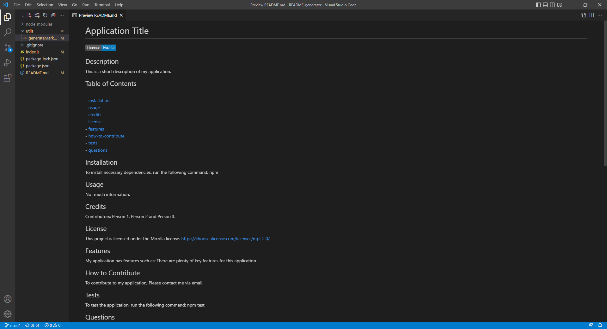

# README-Generator

## Description

My motivation in creating this project was to learn to dynamically create a markdown file using nodejs and template literals. I built a readme generator because it is commonplace in web development to have a readme written in markdown syntax, therefore while dynamically creating the readme I can also become more familiar with markdown syntax. This application solves the problem of having to create a readme from scratch which can be time consuming. I learned a lot about dynamically populating data to a page using template literals as well as using inquierer prompts and reading/writing a file.

Sample README is located in Sample folder.

## Usage
Video link:

[https://drive.google.com/file/d/1vRx6rsE_IEFnrdrz3JobOEHUEqiMehcH/view?usp=share_link](https://drive.google.com/file/d/1vRx6rsE_IEFnrdrz3JobOEHUEqiMehcH/view?usp=share_link)

Screenshot:

